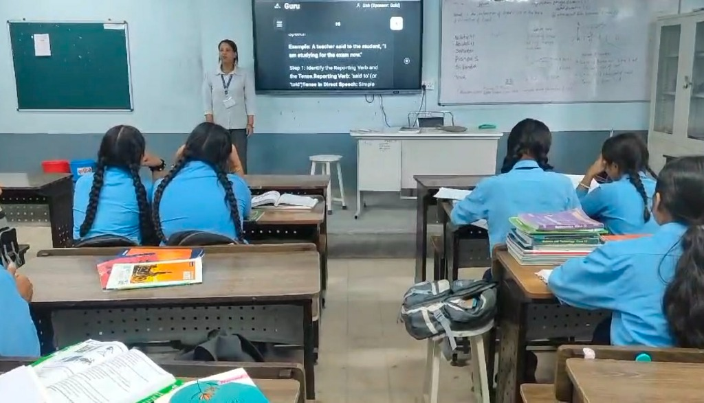

# Guru

### The Offline AI Tutor for Low-Connectivity Areas

[](https://www.shipathon.com)
[](https://github.com/sangamgautam1111/guru/blob/master/App.tsx#L1986-L2075)
[](https://github.com/sangamgautam1111/guru/releases/latest)
[](LICENSE)


*Grade 10 students in rural Nepal learning with Guru offline AI in their classroom.*

An offline AI tutor designed to help students learn concepts with an AI model developed by Google DeepMind. We implemented a JNI–Kotlin bridge to run a quantized Gemma model directly on local hardware, whether it’s a GPU or CPU.

## Features

- **Ask by typing** — chat with Guru one-on-one about Science, Math, English, Nepali, Social Studies, Optional Math, or Computer Science and get step-by-step help
- **Ask by photo** — snap a picture of a textbook problem using your camera, the app reads it through OCR and solves it
- **Ask by voice** — speak your question through the mic using Whisper speech recognition, completely offline
- **Listen to answers** — the app reads solutions back to you out loud using neural text-to-speech
- **Practice MCQs** — quick chapter-wise multiple choice questions with instant answers and explanations to test what you learned
- **Class 10 textbooks built in** — Science, Math, Social Studies, Nepali, English, Optional Math, and Computer Science textbooks (with English and Nepali medium choices for Science and Math), readable inside the app
- **SEE 2081 past papers** — province-wise past papers for Science, Math, English, Nepali, Social Studies, Optional Math, and Computer Science from all 7 provinces
- **SEE 2082 model paper solutions** — full solutions for Science, Math, English, Nepali, and Social Studies
- **Daily study streaks** — track your daily streak to stay consistent every day
- **In-app PDF reader** — zoom, navigate pages, everything inside the app without needing any external app
- **Guru Dakshina** — optional $1 sponsorship to fund an offline AI kit for a rural student

## Download

Download the latest release APK directly for Android:

- **[Download Latest Release APK](https://github.com/sangamgautam1111/guru/releases/latest)**

## Setup

1. **Install the APK**: Download and install `app-release.apk` on your Android device (Android 8.0+).
2. **Start studying right away**: Open the app, type in your name, and you can immediately read textbooks, practice MCQs, or look at past papers. You don't have to wait for any big downloads to get started.
3. **Download AI models when ready**: When you want to chat with Guru, tap "Chat with Guru" to download the Gemma and Whisper models (~2.5 GB). You'll see real-time download speed and progress.
4. **Grant permissions**: Allow camera and microphone access so you can take photos of textbook questions and speak into the mic.
5. **Learn completely offline**: Turn on Airplane mode if you'd like. Once downloaded, asking questions, photo solving, voice recognition, and all books work 100% offline without any internet.

## RevenueCat Integration

Guru is built for the **RevenueCat Shipathon 2026 (Next Gen Track)**. I integrated RevenueCat to handle **Guru Dakshina** — our community sponsorship system where supporters can sponsor offline AI kits for rural students.

[-ff5a5f?style=for-the-badge&logo=revenuecat)](https://github.com/sangamgautam1111/guru/blob/master/App.tsx#L1986-L2075)

Click the button above to jump directly to the exact implementation in `App.tsx` (lines 1986–2075):
- SDK initialization (`Purchases.configure`)
- Checking active entitlements and listening for updates
- Loading offerings and processing sponsorship packages
- Restoring purchases

## Hardware Performance Benchmark

Tested live on physical Android devices using ADB system telemetry (`dumpsys meminfo`, `dumpsys gfxinfo`, and `top`):

| Metric | OPPO A18 (Budget Tier) | Vivo Y27 5G (Performance Tier) |
| :--- | :--- | :--- |
| Model Number | CPH2591 | V2302 (PD2279F_EX) |
| Chipset / SoC | MediaTek Helio G85 (mt6768) | MediaTek Dimensity 6020 (mt6833) |
| Physical RAM | 3.8 GB (Budget 4GB tier) | 7.8 GB (Mid-range 8GB tier) |
| Android Version | Android 15 | Android 15 |
| AI Model | Google Gemma 4 E2B (litertlm) | Google Gemma 4 E2B (litertlm) |
| Model Engine | Google LiteRT-LM (4-bit Dynamic) | Google LiteRT-LM (4-bit Dynamic) |
| CPU Usage (Inference) | ~68.5% (Stable budget execution) | ~16.6% (Ultra-efficient execution) |
| UI Streaming FPS | 20 – 24 FPS | 60.0 FPS (16.6ms target) |
| Memory Pressure (OOM) | 0 Crashes (Stable headroom) | 0 Crashes (Maximum headroom) |
| Network Dependency | Offline | Offline |

## Development

To build and run Guru locally from source:

1. **Clone the repository**:
   ```bash
   git clone https://github.com/sangamgautam1111/guru.git
   cd guru
   ```

2. **Install dependencies**:
   ```bash
   npm install
   ```

3. **Run on Android**:
   ```bash
   npx react-native run-android
   ```

4. **Build Release APK**:
   ```bash
   cd android
   ./gradlew assembleRelease
   ```

---

Made with ❤️ for Nepal students!

